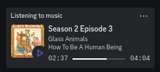

# mpris-rp

Discord's Rich Presence for any MPRIS compatible media player, with automatic album art- effectively, the built-in "Listening to Spotify" feature for any streaming software!

## Installation

Install [bun](https://bun.sh) and clone this repository somewhere. `cd` into it and run `bun install`, then `bun run .`!

Requires Discord to be already running. I'll get reconnecting and stuff like that working at some point maybe.

## Usage

just start playing some music!

I use this with [KDE Connect](https://kdeconnect.kde.org/) to control music from my phone from my laptop.
